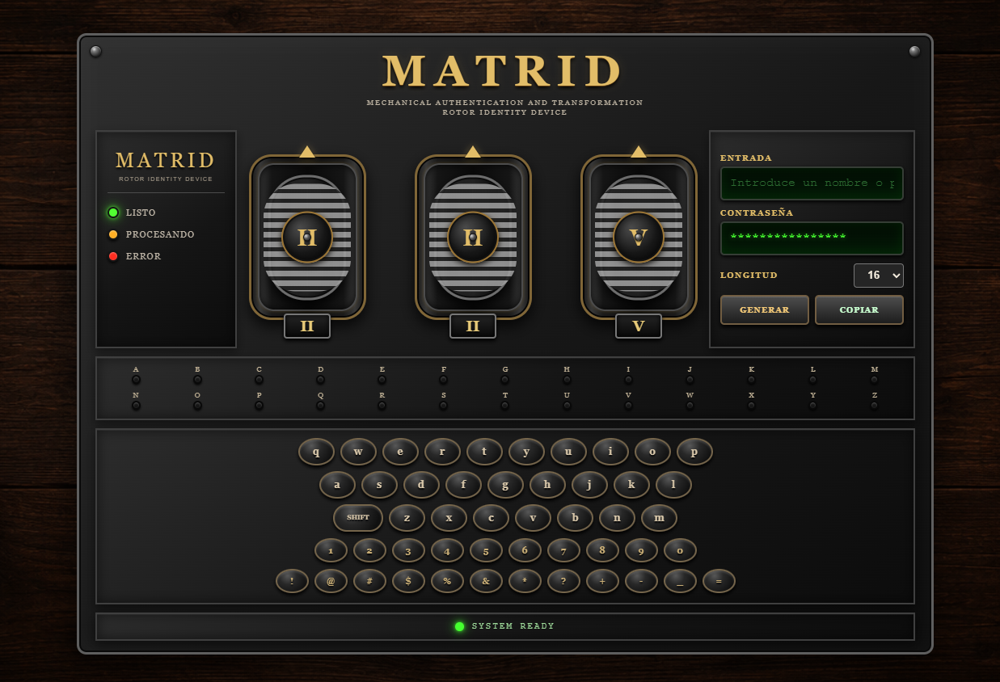

# MATRID v1.0

**MATRID (Mechanical Authentication and Transformation Rotor Identity Device)** es un generador de contraseñas interactivo inspirado en el diseño de las máquinas mecánicas de cifrado.

El proyecto combina una interfaz web desarrollada con **HTML5, CSS3 y JavaScript** con una estética de maquinaria mecánica, incorporando rotores interactivos, teclado, indicadores luminosos y efectos sonoros.

---

## 📸 Captura



---

## 📌 Sobre el proyecto

MATRID nace como un proyecto personal orientado al desarrollo de una aplicación web interactiva.

El objetivo principal es combinar programación, diseño de interfaces y animaciones para crear una herramienta funcional con una identidad visual propia.

La interfaz está inspirada en dispositivos mecánicos de cifrado, utilizando elementos como:

- Rotores mecánicos.
- Indicadores luminosos.
- Teclado físico y virtual.
- Estructuras metálicas.
- Detalles en bronce y dorado.
- Fondo de madera.

---

## 🔮 Futuras mejoras

MATRID está planteado como un proyecto que puede seguir evolucionando.

Entre las futuras líneas de desarrollo se contempla:

- Crear una extensión para navegadores como Chrome, Firefox y Edge.
- Permitir utilizar MATRID directamente desde el navegador al registrarse o iniciar sesión en un sitio web.
- Gestionar las contraseñas generadas para diferentes sitios web.
- Asociar cada contraseña con su correspondiente sitio o servicio.
- Facilitar el acceso y uso de las contraseñas almacenadas.
- Mejorar el sistema de seguridad y protección de los datos almacenados.
- Incorporar un sistema de gestión de credenciales más completo.

El objetivo a largo plazo sería convertir MATRID en una herramienta de gestión de contraseñas integrada en el navegador, manteniendo la identidad visual y el concepto de los rotores mecánicos como elemento principal de la aplicación.

---

## 📄 Licencia

Este proyecto se publica con fines educativos y de portfolio personal.

Todos los derechos reservados.

© 2026 David Díaz Sánchez

---

## ✨ Características

### ⚙️ Rotores mecánicos

- Tres rotores interactivos.
- Avance mediante pulsación.
- Movimiento vertical inspirado en ruedas mecánicas.
- Indicadores de posición mediante números romanos.
- Animaciones CSS.

### ⌨️ Teclado

- Teclado virtual integrado en la interfaz.
- Compatibilidad con teclado físico.
- Letras mayúsculas y minúsculas.
- Números.
- Símbolos.
- Función SHIFT.
- Backspace y Enter.

### 💡 Indicadores

- Iluminación de las teclas al utilizarlas.
- Indicador de estado del sistema.
- Efectos visuales para las acciones del usuario.

### 🔐 Generación de contraseñas

MATRID permite generar contraseñas utilizando:

- Letras mayúsculas.
- Letras minúsculas.
- Números.
- Símbolos.

Caracteres disponibles:

```text
ABCDEFGHIJKLMNOPQRSTUVWXYZ
abcdefghijklmnopqrstuvwxyz
0123456789
!@#$%&*?+-_=